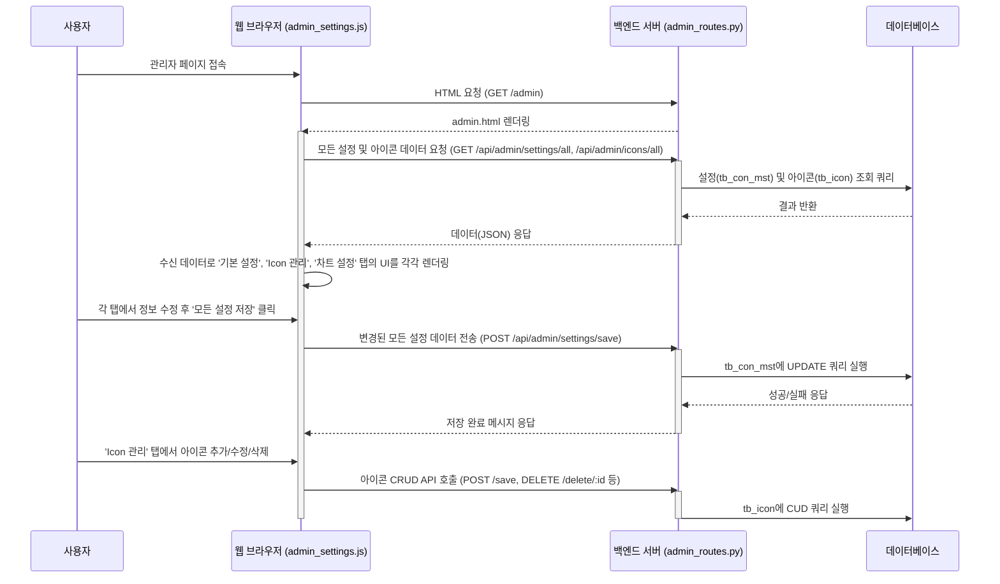
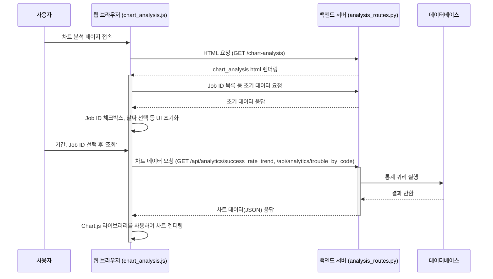
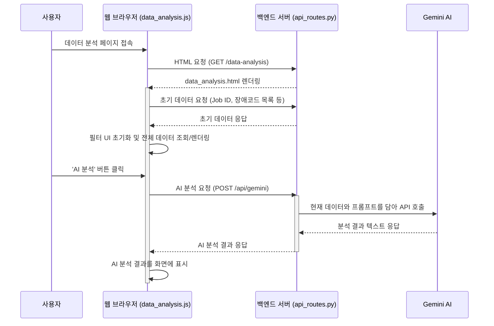
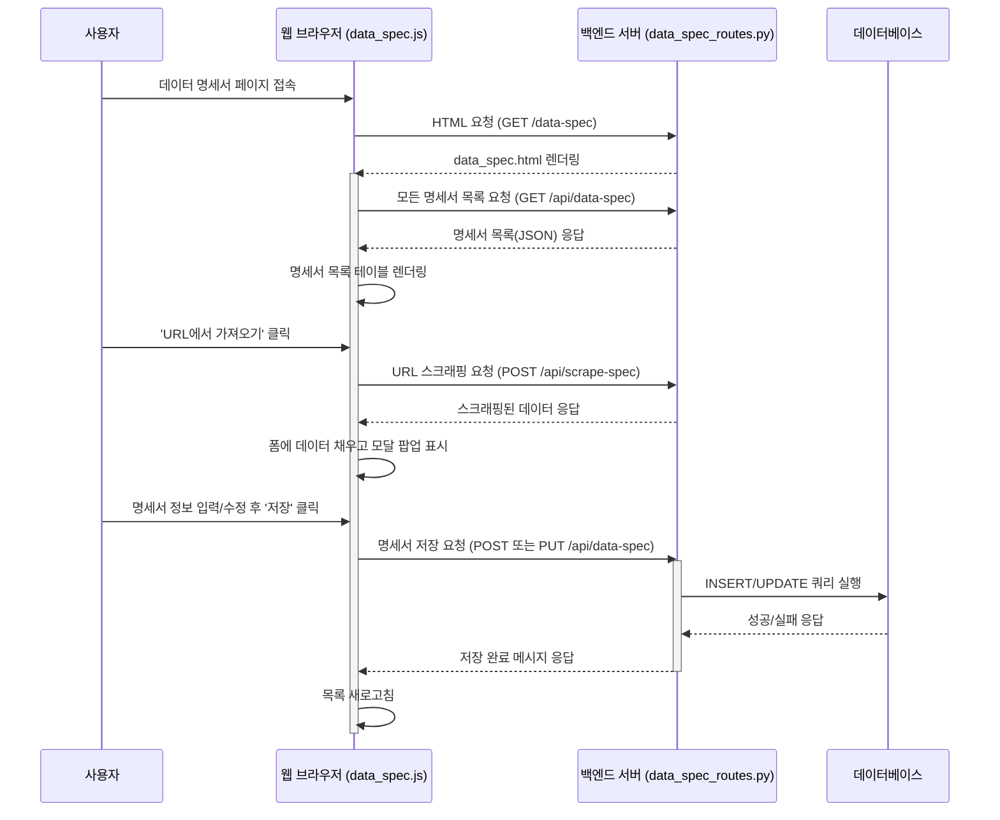
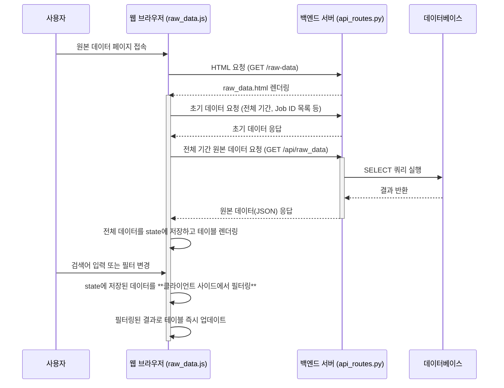
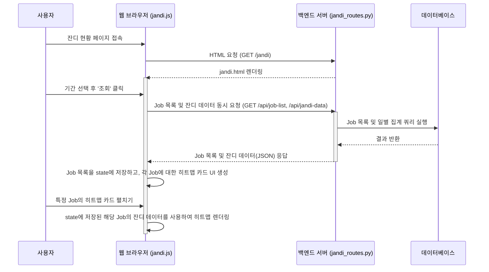
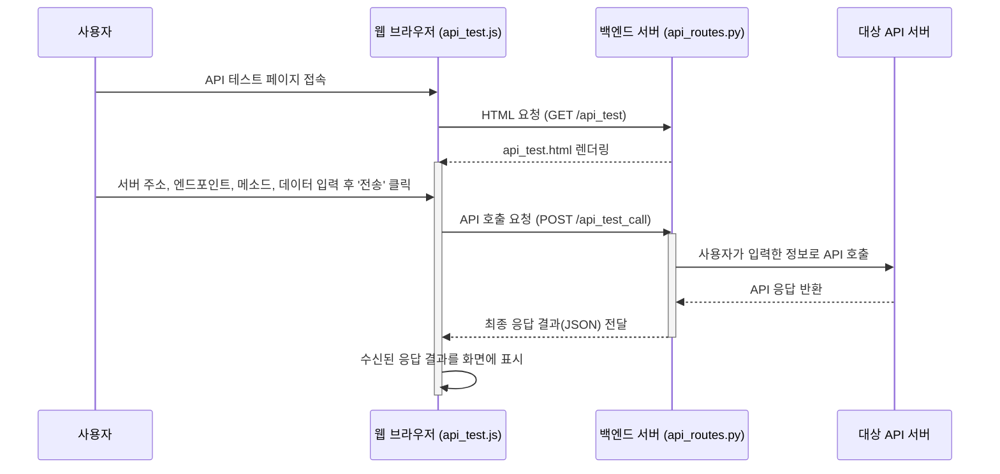

# 시스템 기능 분석 및 기능점수(FP) 산정 자료

이 문서는 시스템의 각 주요 페이지(탭)별 기능 흐름을 분석하고, 간이법에 따라 기능점수(FP)를 산정한 내역을 기술합니다.

---

## 1. 대시보드 페이지 (`dashboard.html`)

### 1.1. 기능 흐름 분석

(이전 `handover_dashboard.md`의 내용과 동일)

---

## 2. 관리자 설정 페이지 (`admin.html`)

### 2.1. 기능 흐름 분석

`admin.html` 페이지는 탭(Tab) 인터페이스를 통해 **'기본 설정'**, **'Icon 관리'**, **'차트/시각화 설정'** 이라는 세 가지 주요 기능을 제공합니다.

-   **Backend:** `routes/admin_routes.py`가 API 엔드포인트를 제공하고, `service/admin_settings_service.py`와 `service/icon_service.py`가 비즈니스 로직을 처리합니다.
-   **Frontend:** `static/js/pages/admin_settings.js`가 페이지 로딩 시 데이터 조회 및 화면 렌더링을 시작하고, `static/js/modules/admin_settings/` 디렉토리의 모듈들이 데이터 통신, UI 렌더링, 이벤트 처리를 각각 담당합니다.

---

## 3. 차트 분석 페이지 (`chart_analysis.html`)

### 3.1. 기능 흐름 분석

`chart_analysis.html` 페이지는 사용자가 선택한 기간과 Job ID에 따라 **수집 성공률 추이**와 **장애 코드별 현황**을 시각적인 차트로 보여주는 기능을 제공합니다.

-   **Backend:** `routes/analysis_routes.py`가 차트 데이터 조회를 위한 API를 제공하고, `service/dashboard_service.py`가 관련 비즈니스 로직을 처리합니다.
-   **Frontend:** `static/js/pages/chart_analysis.js`가 페이지를 초기화하고, `static/js/modules/chart_analysis/` 디렉토리의 모듈들이 데이터 조회, UI 설정, Chart.js를 이용한 차트 렌더링 등의 실제 동작을 수행합니다.

---

## 4. 데이터 분석 페이지 (`data_analysis.html`)

### 4.1. 기능 흐름 분석

`data_analysis.html` 페이지는 대시보드와 유사한 데이터 조회 기능을 기반으로, **장애 코드 필터링**과 **AI를 이용한 자동 분석** 기능을 추가로 제공합니다.

-   **Backend:** `routes/api_routes.py`와 `routes/analysis_routes.py`가 데이터 조회 및 AI 프록시 API를 제공합니다.
-   **Frontend:** `static/js/pages/data_analysis.js`가 페이지를 초기화하고, `static/js/modules/data_analysis/` 디렉토리의 모듈들이 데이터 조회, UI 렌더링, AI 분석 요청 등 핵심 로직을 수행합니다.

---

## 5. 데이터 명세서 페이지 (`data_spec.html`)

### 5.1. 기능 흐름 분석

`data_spec.html` 페이지는 시스템에서 사용하는 외부 데이터(API 등)의 명세를 관리(생성, 조회, 수정, 삭제)하는 CRUD 기능을 제공합니다. 또한, URL을 통해 명세서 정보를 자동으로 스크래핑하는 편의 기능을 포함하고 있습니다.

-   **Backend:** `routes/data_spec_routes.py`가 CRUD 및 스크래핑 API를 제공하고, `service/data_spec_service.py`가 비즈니스 로직을 처리합니다.
-   **Frontend:** `static/js/pages/data_spec.js`가 페이지를 초기화하고, `static/js/modules/data_spec/` 디렉토리의 모듈들이 데이터 조회, UI 렌더링, CRUD 이벤트 처리 등 핵심 로직을 수행합니다.

---

## 6. 원본 데이터 조회 페이지 (`raw_data.html`)

### 6.1. 기능 흐름 분석

`raw_data.html` 페이지는 사용자가 지정한 기간 내의 모든 수집 이력(원본 데이터)을 조회하고, 다양한 조건(Job ID, 상태, 장애 코드, 검색어)으로 필터링하여 상세 내용을 확인할 수 있는 기능을 제공합니다.

-   **Backend:** `routes/api_routes.py`가 페이지 렌더링과 원본 데이터 조회 API(`GET /api/raw_data`)를 제공합니다.
-   **Frontend:** `static/js/pages/raw_data.js`가 페이지를 초기화하고, `static/js/modules/rawData/` 디렉토리의 모듈들이 데이터 조회, UI(필터, 테이블, 페이지네이션) 렌더링, 클라이언트 사이드 필터링 로직을 수행합니다.

---

## 7. 잔디 현황 페이지 (`jandi.html`)

### 7.1. 기능 흐름 분석

`jandi.html` 페이지는 Github의 활동 그래프처럼, 각 Job의 일별 데이터 수집 현황을 히트맵(속칭 '잔디') 형태로 시각화하여 보여주는 기능을 제공합니다. 이를 통해 사용자는 Job별 활동 패턴을 직관적으로 파악할 수 있습니다.

-   **Backend:** `routes/jandi_routes.py`가 페이지 렌더링, Job 목록 조회, 일별 수집 현황 데이터 조회 API를 제공합니다.
-   **Frontend:** `static/js/pages/jandi.js`가 페이지를 초기화하고, 데이터를 조회하여 각 Job에 대한 히트맵 카드를 생성합니다. 실제 히트맵 렌더링은 `modules/data_analysis/heatmap.js` 모듈을 통해 이루어집니다.

---

## 8. API 테스트 페이지 (`api_test.html`)

### 8.1. 기능 흐름 분석

`api_test.html` 페이지는 개발자나 관리자가 시스템의 API 엔드포인트를 직접 호출하고 응답을 확인할 수 있는 테스트 도구를 제공합니다.

-   **Backend:** `routes/api_routes.py`가 페이지 렌더링과 API 호출 프록시 기능(`POST /api_test_call`)을 제공합니다.
-   **Frontend:** `static/js/pages/api_test.js`가 사용자의 입력을 받아 백엔드에 API 테스트를 요청하고, 그 결과를 화면에 표시하는 로직을 담당합니다.

---

## 9. 간이법 기능점수(FP) 산정 (상세)

### 9.1. 메뉴별 FP 산정 세부 내역

각 기능의 복잡도는 관련 테이블 수(RET/FTR)와 데이터 항목 수(DET)를 추정하여 산정되었으며, '비고'란에 그 사유를 기술합니다.

#### 1. 대시보드 페이지 (`dashboard.html`)

##### 데이터 기능 (Data Functions)
| 기능명 | 유형 | RET/DET (추정) | 복잡도 | 비고 (복잡도 산정 사유) | FP |
| :--- | :--- | :--- | :--- | :--- | :--- |
| 수집 이력 관리 | EIF | 1 RET, 25 DET | **보통** | 시스템의 핵심 데이터(tb_con_hist)를 외부 참조. 관리 항목이 많아 '보통'으로 산정. | 7 |
| 장애 코드 관리 | EIF | 1 RET, 10 DET | **낮음** | 단순 코드성 정보(tb_trbl_hist)를 참조하므로 '낮음'으로 산정. | 5 |
| **소계** | | | | | **12** |

##### 트랜잭션 기능 (Transactional Functions)
| 기능명 | 유형 | FTR/DET (추정) | 복잡도 | 비고 (복잡도 산정 사유) | FP |
| :--- | :--- | :--- | :--- | :--- | :--- |
| 요약 데이터 조회 | EQ | 2 FTR, 10 DET | **보통** | 2개 테이블(`con_hist`, `con_mst`)을 조인하여 10개 내외의 핵심 지표만 집계하므로 '보통'으로 산정. | 4 |
| 추이 데이터 조회 | EQ | 2 FTR, 15 DET | **보통** | 2개 테이블을 조인하여 일별 추이 데이터를 집계. 요약 조회보다 다루는 데이터 항목(DET)이 약간 많아짐. | 4 |
| 원본 데이터 조회 | EQ | 3 FTR, 25 DET | **높음** | 3개 테이블(`con_hist`, `con_mst`, `trbl_hist`)을 조인하고, 상세 분석을 위해 25개 이상의 많은 데이터 항목(DET)을 조회하므로 '높음'으로 산정. | 6 |
| 이벤트 로그 조회 | EQ | 1 FTR, 20 DET | **보통** | 단일 테이블에서 20개 내외의 로그 항목을 조회하므로 '보통'으로 산정. | 4 |
| 이벤트 로그 파일 저장 | EI | 1 FTR, 20 DET | **보통** | 클라이언트의 로그 데이터를 받아 서버에 텍스트 파일로 생성. 1개 논리파일(로그파일)에 영향을 줌. | 4 |
| 최초/최종일자 조회 | EQ | 1 FTR, 2 DET | **낮음** | 달력 UI 초기화를 위해 단일 테이블에서 날짜 2개만 조회하는 단순 기능. | 3 |
| **소계** | | | | | **25** |

#### 2. 관리자 설정 페이지 (`admin.html`)

##### 데이터 기능 (Data Functions)
| 기능명 | 유형 | RET/DET (추정) | 복잡도 | 비고 (복잡도 산정 사유) | FP |
| :--- | :--- | :--- | :--- | :--- | :--- |
| Job 설정 관리 | ILF | 1 RET, 50+ DET | **높음** | 이 페이지에서 Job의 모든 설정(기본, 차트 등)을 관리. 관리 항목(DET)이 50개를 초과하여 '높음'으로 산정. | 15 |
| 아이콘 정보 관리 | ILF | 1 RET, 5 DET | **낮음** | 아이콘 코드, 경로 등 5개 내외의 단순 정보를 관리하므로 '낮음'으로 산정. | 7 |
| **소계** | | | | | **22** |

##### 트랜잭션 기능 (Transactional Functions)
| 기능명 | 유형 | FTR/DET (추정) | 복잡도 | 비고 (복잡도 산정 사유) | FP |
| :--- | :--- | :--- | :--- | :--- | :--- |
| 기본/차트 설정 조회 | EQ | 1 FTR, 50+ DET | **높음** | 단일 테이블(`tb_con_mst`)이지만 조회하는 항목(DET)이 50개를 초과하여 '높음'으로 산정. | 6 |
| 기본/차트 설정 저장 | EI | 1 FTR, 50+ DET | **높음** | 단일 테이블(`tb_con_mst`)이지만 수정하는 항목(DET)이 50개를 초과하여 '높음'으로 산정. | 6 |
| 설정 JSON 가져오기/내보내기 | EI/EO | 1 FTR, 50+ DET | **높음** | 파일 입출력과 DB 처리가 결합되고, 다루는 데이터 항목(DET)이 많아 '높음'으로 산정. | 13 |
| 아이콘 정보 조회 | EQ | 1 FTR, 5 DET | **낮음** | 단일 테이블의 단순 정보(5개 내외)를 조회하므로 '낮음'으로 산정. | 3 |
| 아이콘 정보 저장/수정 | EI | 1 FTR, 5 DET | **낮음** | 단일 테이블의 단순 정보(5개 내외)를 CUD하므로 '낮음'으로 산정. | 3 |
| 아이콘 정보 삭제 | EI | 1 FTR, 2 DET | **낮음** | 단일 테이블에서 PK를 기준으로 특정 레코드를 삭제하는 단순 기능. | 3 |
| 아이콘 CSV 가져오기/내보내기 | EI/EO | 1 FTR, 5 DET | **보통** | CSV 파일 입출력과 DB 처리가 결합된 복합 기능으로 '보통'으로 산정. | 9 |
| **소계** | | | | | **43** |

#### 3. 차트 분석 페이지 (`chart_analysis.html`)

##### 트랜잭션 기능 (Transactional Functions)
| 기능명 | 유형 | FTR/DET (추정) | 복잡도 | 비고 (복잡도 산정 사유) | FP |
| :--- | :--- | :--- | :--- | :--- | :--- |
| 성공률 추이 조회 | EQ | 3 FTR, 10 DET | **높음** | 3개 테이블을 조인하고, 복잡한 시계열 집계(GROUP BY, 집계 함수 등) 로직을 통해 차트용 데이터를 생성하므로 '높음'으로 산정. | 6 |
| 장애 코드 현황 조회 | EQ | 3 FTR, 10 DET | **높음** | 3개 테이블을 조인하고, 코드별로 현황을 집계하는 복잡한 로직이 포함되므로 '높음'으로 산정. | 6 |
| 분석용 Job ID 목록 조회 | EQ | 1 FTR, 1 DET | **낮음** | 단일 테이블에서 중복을 제거한 ID 목록만 조회하는 단순 기능. | 3 |
| **소계** | | | | | **15** |

#### 4. 데이터 분석 페이지 (`data_analysis.html`)

##### 트랜잭션 기능 (Transactional Functions)
| 기능명 | 유형 | FTR/DET (추정) | 복잡도 | 비고 (복잡도 산정 사유) | FP |
| :--- | :--- | :--- | :--- | :--- | :--- |
| 분석 데이터 종합 조회 | EQ | 4 FTR, 30 DET | **높음** | 4개 이상의 테이블을 참조하여 요약, 추이, 원본 데이터를 한 번에 조회하는 복잡한 기능이므로 '높음'으로 산정. | 6 |
| 장애 코드 목록 조회 | EQ | 1 FTR, 2 DET | **낮음** | 단일 테이블에서 필터링에 사용할 코드와 이름만 조회하는 단순 기능. | 3 |
| 장애 코드 매핑 조회 | EQ | 1 FTR, 2 DET | **낮음** | 필터링 UI에 사용할 코드-영문명 매핑 정보를 조회하는 단순 기능. | 3 |
| AI 분석 요청 | EO | 2 FTR, 50+ DET | **높음** | 여러 테이블의 데이터를 종합(FTR 높음)하고, AI 모델이 이해할 수 있도록 50개 이상의 많은 데이터(DET 높음)를 가공하여 프롬프트를 구성하므로 '높음'으로 산정. | 7 |
| **소계** | | | | | **19** |

#### 5. 데이터 명세서 페이지 (`data_spec.html`)

##### 데이터 기능 (Data Functions)
| 기능명 | 유형 | RET/DET (추정) | 복잡도 | 비고 (복잡도 산정 사유) | FP |
| :--- | :--- | :--- | :--- | :--- | :--- |
| 데이터 명세서 관리 | ILF | 2 RET, 20 DET | **보통** | 2개의 연관 테이블(Master-Detail)을 동시에 관리하며, 항목 수가 20개 내외이므로 '보통'으로 산정. | 10 |

##### 트랜잭션 기능 (Transactional Functions)
| 기능명 | 유형 | FTR/DET (추정) | 복잡도 | 비고 (복잡도 산정 사유) | FP |
| :--- | :--- | :--- | :--- | :--- | :--- |
| 데이터 명세서 조회 | EQ | 2 FTR, 20 DET | **보통** | 2개 연관 테이블을 조인하여 상세 정보를 조회하므로 '보통'으로 산정. | 4 |
| 데이터 명세서 생성/수정 | EI | 2 FTR, 25 DET | **높음** | 2개 테이블(Master-Detail)에 걸쳐 25개 이상의 항목을 동시에 CUD 처리해야 하므로 '높음'으로 산정. | 6 |
| 데이터 명세서 삭제 | EI | 2 FTR, 5 DET | **보통** | 2개 연관 테이블의 데이터를 동시에 삭제하고, 비밀번호 확인 로직이 포함되어 '보통'으로 산정. | 4 |
| URL 스크래핑으로 명세서 생성 | EI | 1 FTR, 20 DET | **높음** | 외부 URL 파싱 및 데이터 추출이라는 복잡한 로직을 거쳐 DB에 입력(EI)하므로 '높음'으로 산정. | 6 |
| 명세서 이름 중복 확인 | EQ | 1 FTR, 2 DET | **낮음** | 단일 테이블에서 이름의 존재 여부만 확인하는 단순 조회 기능. | 3 |
| **소계** | | | | | **23** |

#### 6. 원본 데이터 조회 페이지 (`raw_data.html`)

##### 트랜잭션 기능 (Transactional Functions)
| 기능명 | 유형 | FTR/DET (추정) | 복잡도 | 비고 (복잡도 산정 사유) | FP |
| :--- | :--- | :--- | :--- | :--- | :--- |
| 원본 데이터 상세 조회 | EQ | 3 FTR, 50+ DET | **높음** | 3개 테이블을 조인하여 50개 이상의 매우 많은 항목을 조회하고, 클라이언트 사이드 필터링까지 고려하여 '높음'으로 산정. | 6 |
| 필터용 Job ID/장애코드 조회 | EQ | 2 FTR, 2 DET | **낮음** | 2개 테이블에서 필터 옵션을 위한 ID와 코드만 단순 조회하므로 '낮음'으로 산정. | 3 |
| **소계** | | | | | **9** |

#### 7. 잔디 현황 페이지 (`jandi.html`)

##### 트랜잭션 기능 (Transactional Functions)
| 기능명 | 유형 | FTR/DET (추정) | 복잡도 | 비고 (복잡도 산정 사유) | FP |
| :--- | :--- | :--- | :--- | :--- | :--- |
| 잔디 데이터 조회 | EQ | 2 FTR, 10 DET | **높음** | 2개 테이블을 조인하여 일별 현황을 집계하는 복잡한 쿼리가 필요하고, 히트맵이라는 특수한 데이터 구조로 가공해야 하므로 '높음'으로 산정. | 6 |
| 잔디용 Job 목록 조회 | EQ | 2 FTR, 10 DET | **보통** | 2개 테이블을 조인하고, 서버사이드 페이지네이션 로직이 포함되어 '보통'으로 산정. | 4 |
| Job 마스터 정보 조회 | EQ | 1 FTR, 5 DET | **낮음** | 잔디 카드에 표시할 Job의 기본 정보를 조회하는 단순 기능. | 3 |
| **소계** | | | | | **13** |

#### 8. API 테스트 페이지 (`api_test.html`)

##### 트랜잭션 기능 (Transactional Functions)
| 기능명 | 유형 | FTR/DET (추정) | 복잡도 | 비고 (복잡도 산정 사유) | FP |
| :--- | :--- | :--- | :--- | :--- | :--- |
| API 테스트 호출 | EI | 1 FTR, 10 DET | **보통** | 외부 API를 호출하는 프록시 기능으로, 동적 파라미터 처리 등 내부 로직을 고려하여 '보통'으로 산정. | 4 |
| **소계** | | | | | **4** |

### 9.2. 기능점수(FP) 총괄표

| 페이지명 | 데이터 기능 (FP) | 트랜잭션 기능 (FP) | 페이지 소계 (FP) | 비고 |
| --- | --- | --- | --- | --- |
| 1. 대시보드 (`dashboard.html`) | 12 | 25 | 37 | |
| 2. 관리자 설정 (`admin.html`) | 22 | 43 | 65 | |
| 3. 차트 분석 (`chart_analysis.html`) | 0 | 15 | 15 | |
| 4. 데이터 분석 (`data_analysis.html`) | 0 | 19 | 19 | |
| 5. 데이터 명세서 (`data_spec.html`) | 10 | 23 | 33 | |
| 6. 원본 데이터 조회 (`raw_data.html`) | 0 | 9 | 9 | |
| 7. 잔디 현황 (`jandi.html`) | 0 | 13 | 13 | |
| 8. API 테스트 (`api_test.html`) | 0 | 4 | 4 | 개발/운영 지원 기능 |
| **총계** | **44** | **151** | **195** | |

*   **보정계수(VAF):** 1.0 (평균적인 기술 복잡도 및 환경 요인으로 가정)
*   **조정 후 총 기능점수 (Adjusted FP):** 195 * 1.0 = **195 FP**
