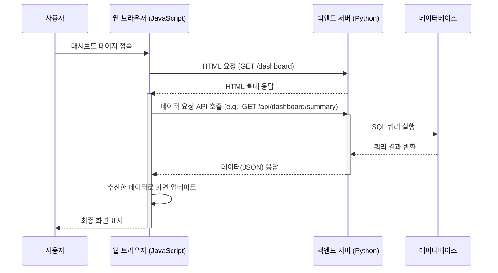

# 대시보드 페이지 데이터 흐름 인수인계 자료 (최신화)

이 문서는 `dashboard.html` 페이지의 데이터 흐름과 주요 기능에 대해, 코드 수준에서 상세하게 설명합니다.

## 1. 프로세스 플로우차트 (Process Flowchart)

사용자가 대시보드 페이지에 접속해서 데이터를 보기까지의 전체 흐름은 다음과 같습니다.

---

## 2. 컴포넌트별 상세 설명 (최신)

### 카드 1: 날짜 선택 (Date Selection)

*   **핵심 기능**: 사용자가 조회할 날짜 범위를 선택하게 하고, 선택된 날짜에 맞춰 데이터를 다시 불러오는 기능입니다.
*   **전체 흐름**:
    `[events.js]` `initializeDashboard()` **->** `[ui.js]` `displayMinMaxDates()` **->** `[Backend API]` `/api/dashboard/min-max-dates` **->** `[routes/dashboard_routes.py]` `get_min_max_dates_api()` **->** `[service/dashboard_service.py]` `get_min_max_dates()` **->** `[dao/con_hist_dao.py]` `get_min_max_dates()` **->** `[DB]`

*   **상세 설명**:
    1.  **[Frontend]** `static/js/pages/dashboard.js`의 `initializeDashboard()`가 실행되며, `displayMinMaxDates()`를 호출하여 DB에 저장된 데이터의 최소/최대 날짜를 가져와 달력의 기본 범위로 설정합니다.
    2.  **[Backend]** `/api/dashboard/min-max-dates` API(`dashboard_routes.py`)가 요청을 받아 `DashboardService`를 통해 DB에서 날짜 범위를 조회하여 반환합니다.
    3.  **[Frontend]** 사용자가 날짜를 변경하면 `loadDashboardSummary()` 함수가 호출되어 아래의 요약 정보와 상세 현황 데이터를 다시 로드합니다.

---

### 카드 2, 3, 4: 요약 정보 카드 (Summary Cards)

*   **핵심 기능**: 전체 Job 개수, 총 수집 건수, 기간별(오늘, 주간, 월간 등) 수집 현황을 요약하여 보여줍니다.
*   **전체 흐름**:
    `[events.js]` `loadDashboardSummary()` **->** `[Backend API]` `/api/dashboard/summary` **->** `[routes/dashboard_routes.py]` `get_dashboard_summary()` **->** `[service/dashboard_service.py]` `get_summary()` **->** `[dao/con_hist_dao.py]` `get_summary()` **->** `[DB]` **->** `[ui.js]` `updateSummaryCards()`

*   **상세 설명**:
    1.  **[Frontend]** `loadDashboardSummary()`가 선택된 날짜를 파라미터로 하여 `/api/dashboard/summary` API를 호출합니다.
    2.  **[Backend]** `get_dashboard_summary()` 함수(`dashboard_routes.py`)가 요청을 받아 `DashboardService`의 `get_summary()`를 호출합니다. 이 서비스는 DAO를 통해 기간별, Job ID별 통계를 모두 계산하는 SQL을 실행합니다.
    3.  **[Frontend]** API 응답으로 받은 전체 통계 데이터를 `updateSummaryCards()` 함수(`ui.js`)에 전달합니다. 이 함수는 데이터를 가공하여 '총 Job ID 개수', '총 수집 건수' 등의 값을 계산하고 화면의 각 카드에 숫자를 업데이트합니다.

---

### 카드 5: Job ID별 상세 현황 (Detailed Table)

*   **핵심 기능**: 각 Job ID별로 모든 상세 통계(성공률, 연속 실패 등)를 보여주는 메인 테이블입니다. 검색, 정렬, 페이지 나누기 기능이 포함되어 있습니다.
*   **전체 흐름**:
    `[events.js]` `loadDashboardSummary()` **->** `[...API 호출 및 데이터 수신...]` **->** `[ui_components/pagination.js]` `initPagination()` **->** `[dashboardTable.js]` `renderDashboardSummaryTable()`

*   **상세 설명**:
    1.  **[Frontend]** '요약 정보 카드'와 동일한 `summaryData`를 `initPagination` 범용 모듈에 전달합니다.
    2.  **[Pagination]** `initPagination` 모듈은 전체 데이터를 받아 페이지 크기에 맞게 자르고, 검색어나 정렬 기준에 따라 데이터를 필터링/정렬합니다.
    3.  **[Frontend]** `initPagination`에 콜백 함수로 등록된 `renderDashboardSummaryTable()`(`dashboardTable.js`)이 호출됩니다. 이 함수는 현재 페이지에 해당하는 데이터만 받아 실제 HTML 테이블(`<tr>`, `<td>`)을 생성하여 화면에 그립니다.

---

### 카드 6 & 7: 이벤트 로그 (표시 및 저장) (Event Log)

*   **핵심 기능**: 시스템의 주요 동작 이력(로그)을 별도로 조회하고, 현재 조회된 로그를 서버에 파일로 저장하는 기능입니다.
*   **전체 흐름 (데이터 로딩)**:
    `[eventLog.js]` `loadEventLogPage()` **->** `[Backend API]` `/api/con_hist_event_log` **->** `[routes/api_routes.py]` `api_con_hist_event_log()` **->** `[service/dashboard_service.py]` `get_event_log()` **->** `[DB]` **->** `[eventLog.js]` `renderEventLogPage()`
*   **전체 흐름 (데이터 저장)**:
    `[사용자 클릭]` **->** `[eventLog.js]` `save-event-log-btn 리스너` **->** `[Backend API]` `/api/save-event-log` **->** `[routes/api_routes.py]` `save_event_log()` **->** `[서버 log/ 폴더에 파일 생성]`

*   **상세 설명 (최신화)**:
    1.  **[Frontend]** 대시보드 메인 데이터와는 **별개의 API**를 통해 독립적으로 조회됩니다. `eventLog.js`의 `loadEventLogPage()` 함수가 `/api/con_hist_event_log` API를 호출합니다.
    2.  **[Backend]** 이 API는 **`api_routes.py`** 에 정의되어 있으며, `api_con_hist_event_log()` 함수가 `DashboardService`를 통해 DB에서 이벤트 로그를 조회합니다.
    3.  **[Frontend]** '로그 저장' 버튼 클릭 시, `eventLog.js`는 현재 로드된 모든 로그 데이터를 `/api/save-event-log` API(**`api_routes.py`** 소재)에 POST 방식으로 전송하여 서버 `log/` 디렉토리에 텍스트 파일로 저장합니다.

---

## 3. 간이법 기능점수(Function Point) 산정

아래는 현재 대시보드 시스템의 기능을 간이법으로 분석한 결과입니다. 기능점수는 시스템의 규모와 복잡도를 정량적으로 평가하는 지표로 활용될 수 있습니다.

### 3.1. 데이터 기능 (Data Functions)

| 기능명 | 유형 | 복잡도 | 설명 | FP |
| --- | --- | --- | --- | --- |
| 수집 이력 관리 | ILF | 보통 | Job별 수집 성공/실패 이력을 관리하는 핵심 데이터 (tb_con_hist) | 10 |
| 이벤트 로그 관리 | ILF | 낮음 | 시스템의 주요 동작 이력을 기록하는 데이터 (tb_con_hist_event_log) | 7 |
| Job 설정 관리 | EIF | 보통 | Job별 아이콘, 임계값 등 외부 시스템과 연동될 수 있는 설정 정보 (tb_admin_settings) | 10 |
| **소계** | | | | **27** |

*   **ILF**: Internal Logical File (내부 논리 파일)
*   **EIF**: External Interface File (외부 연계 파일)

### 3.2. 트랜잭션 기능 (Transactional Functions)

| 기능명 | 유형 | 복잡도 | 설명 | FP |
| --- | --- | --- | --- | --- |
| 대시보드 요약 조회 | EQ | 높음 | 날짜 범위에 따라 여러 테이블을 조인하여 복합적인 통계(요약, 상세)를 조회 | 6 |
| 이벤트 로그 조회 | EQ | 보통 | 날짜 범위에 따라 이벤트 로그를 조회하고 필터링 | 4 |
| 날짜 범위 조회 | EQ | 낮음 | 데이터의 최소/최대 날짜를 단순 조회 | 3 |
| 관리자 설정 조회 | EQ | 낮음 | 모든 Job의 설정 정보를 조회 | 3 |
| 이벤트 로그 저장 | EO | 보통 | 조회된 로그 데이터를 서버에 파일로 생성(출력) | 5 |
| **소계** | | | | **21** |

*   **EQ**: External Inquiry (외부 조회)
*   **EO**: External Output (외부 출력)

### 3.3. 최종 기능점수 (Total Function Points)

| 구분 | 기능점수 (FP) |
| --- | --- |
| 데이터 기능 | 27 |
| 트랜잭션 기능 | 21 |
| **총계 (조정 전)** | **48** |

> **참고**: 위 FP는 시스템의 기능적 측면만을 분석한 **조정 전 기능점수(UFP)**입니다. 실제 프로젝트 규모 산정 시에는 성능, 보안, 재사용성 등 14개의 시스템 특성을 고려한 **가치 조정 인자(VAF)**를 곱하여 최종 기능점수를 산출해야 합니다. 간이법에서는 일반적으로 `UFP * 1.0` 내외로 추산합니다.
